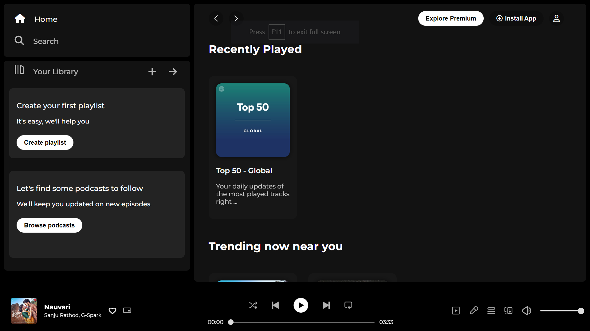

# Spotify Clone Website

> A web application that replicates the core features of the Spotify music streaming service.

## Table of Contents

- [Introduction](#introduction)
- [Features](#features)
- [Demo](#demo)
- [Technologies Used](#technologies-used)
- [Installation](#installation)

## Introduction

Welcome to the Spotify Clone Website repository! This project is a web application designed to mimic the essential functionalities of the popular Spotify music streaming service. Users can explore, search, and play music as well as create and manage playlists.

## Features

- Browse and search for songs, albums, and artists
- Create and manage playlists
- Play, pause, skip, and control volume
- Responsive design for various devices

## Demo

Link-(<link>https://spotify-jyt5.onrender.com/<link>)

## Technologies Used

- HTML5, CSS3, JavaScript

## Installation

1. Clone the repository: `git clone https://github.com/your-username/spotify-clone.git`
2. Change into the project directory: `cd spotify-clone`

